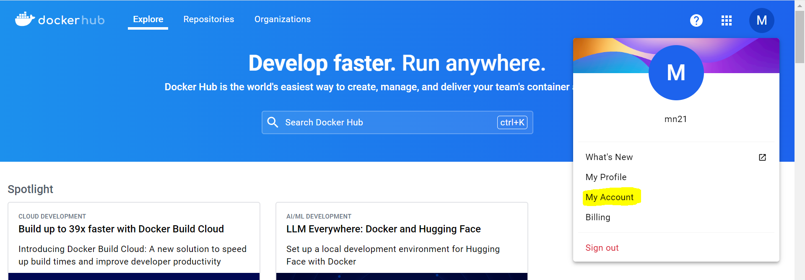
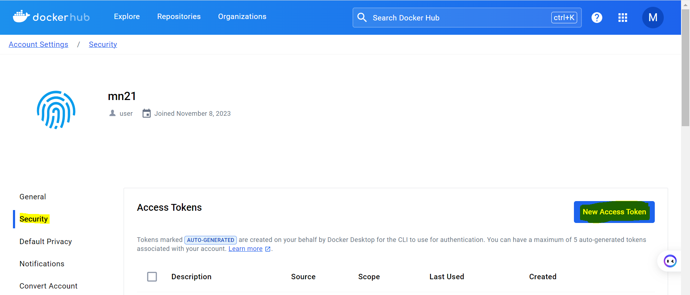
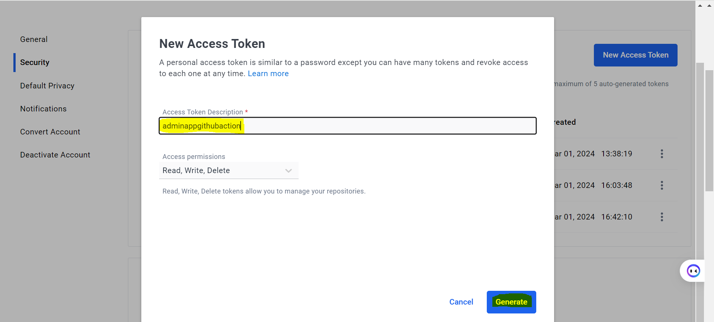
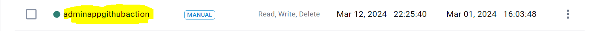
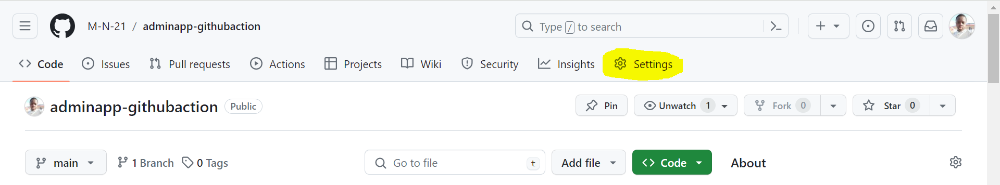
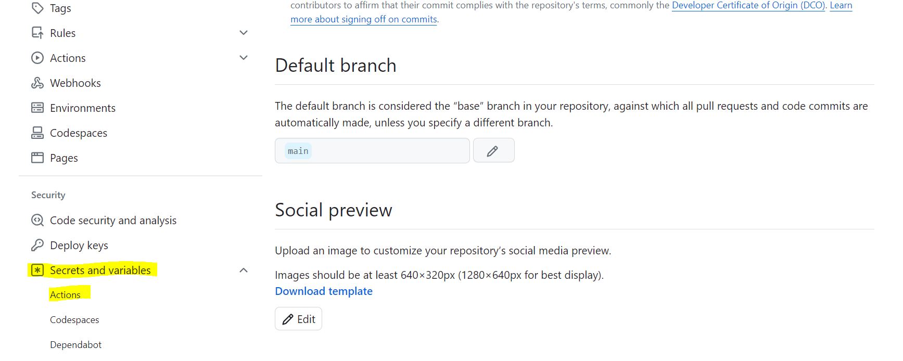
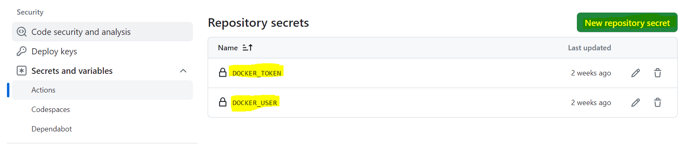
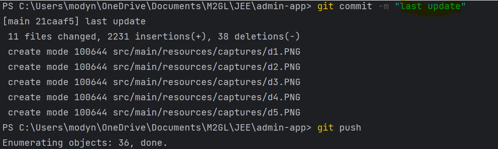
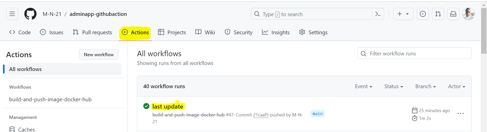
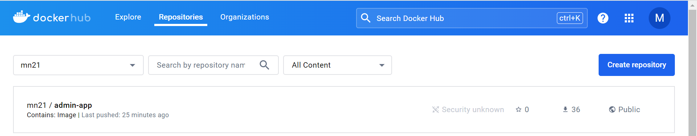

# Projet admin-app

Ce projet est un projet Spring Boot. Il utilise Java 8, maven, docker, logs,...
Dans le but de faire du CI/CD avec github pour builder nos applications et les pusher vers notre dockerhub, nous allons créer un dossier `.github` dans la racine du projet et dans lequel il y aura un dossier `workflows`, qui à son tour aura le fichier `build.yml`.
# Build and Push Docker Image to Docker Hub

Ce workflow GitHub Actions est déclenché à chaque push sur les branches main ou release, à l'exception des changements apportés aux fichiers README.md.

## Fonctionnalités

- Ce workflow utilise Maven pour construire le projet Java.
- Il publie ensuite l'image Docker générée sur Docker Hub.

## Étapes

### Étape 1: Récupération du Code Source

Cette étape utilise l'action `checkout@v2` pour récupérer le code source du référentiel.

### Étape 2: Configuration de JDK 8

Cette étape configure JDK 8 en utilisant l'action `setup-java@v2`. Elle spécifie également la version de Java, la distribution (Temurin) et met en cache Maven.

### Étape 3: Construction avec Maven

Dans cette étape, le projet Java est construit en utilisant Maven avec la commande `mvn -B package`.

### Étape 4: Publication sur Docker

Enfin, l'action `spring-boot:build-image` de Maven est utilisée pour construire une image Docker à partir du projet Spring Boot. L'image est publiée sur Docker Hub en utilisant les informations d'identification stockées dans les secrets de GitHub.

## Secrets

Ce workflow utilise les secrets suivants :

- `DOCKER_USER`: Nom d'utilisateur Docker Hub.
- `DOCKER_TOKEN`: Jeton d'accès Docker Hub.

# Creation du token pour notre repos
### Se connecter à DockerHub puis cliquer sur my account

### Ensuite dans security puis cliquer sur New access token

### Donner un nom à votre token puis generate

### Resultat token generé


# Creation des tokens `DOCKER_USER` et `DOCKER_TOKEN` dans github
### Allez sur settings

### Puis dans Secrets and variables, Actions

### Creer les tokens sachant que dans `DOCKER_USER` on aura le username de votre compte DockerHub et dans `DOCKER_TOKEN` le token que vous avez géréré pour votre application au niveau de dockerhub


# Workflow
Le workflow a été programmé pour que à chaque push dans la branche `main`, il s'execute.
```
on:
  push:
    branches: [ main, release ]
    paths-ignore:
      - '**/README.md'
```

Après le push on verra l'execution de notre workflow au niveau de Action si tout ce passe bien il sera vert et notre image docker sera généré et mis sur notre dockerhub grace à cette instruction à suivre tout en se basant du génie `maven`
```
run: |
          mvn -B spring-boot:build-image -Dspring-boot.build-image.publish=true \
              -Ddocker.user=${{ secrets.DOCKER_USER }} -Ddocker.token=${{ secrets.DOCKER_TOKEN }} \
              -DskipTests
```
## Resultats

image sur dockerhub au niveau de nos repositories


### Bien à vous `M.N.21`

